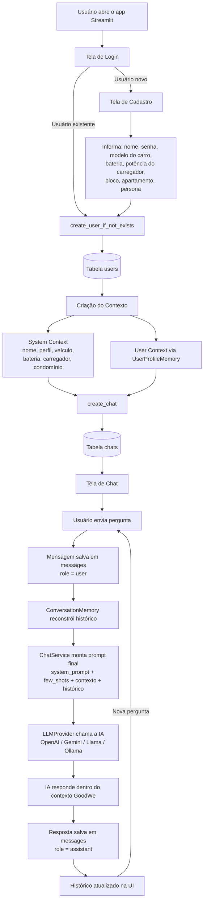

# 🔋 GoodWe ChargeOps AI Assistant

> Chatbot inteligente contextualizado para o ecossistema **ChargeGrid Intelligence / EV ChargeOps**, desenvolvido para o **EV Challenge 2026**.

---

## 👥 Integrantes

| Nome | RM |
|---|---|
| Davi Q. Zuolo | 571669 |
| Gustavo Zagato | 569420 |
| Daniel Vilela Mana | 571632 |
| Kayo Henderson | 570706 |

---

## 📌 Sobre o Projeto

O **GoodWe ChargeOps AI Assistant** é um chatbot inteligente desenvolvido no contexto do **EV Challenge 2026**, voltado para **eletromobilidade, carregamento de veículos elétricos (VE) em condomínios e operação de infraestrutura de recarga**, dentro do universo da GoodWe.

O objetivo desta Sprint **não foi construir um sistema completo de gerenciamento de carregamento**, mas sim desenvolver um **chatbot contextualizado**, capaz de responder dúvidas relacionadas ao domínio do problema, utilizando:

- Inteligência Artificial com contexto via *system prompt*
- Memória de conversa (histórico persistido em banco de dados)
- Perfis personalizados de usuário (persona)

O chatbot funciona como uma **camada operacional e educacional** do ecossistema ChargeOps, permitindo que **moradores, síndicos, operadores e visitantes** consultem informações sobre carregamento, regras de utilização, estimativas de carga, funcionamento dos equipamentos e conceitos técnicos do ambiente GoodWe.

### 🔁 Evolução do Projeto

- **Sprint 1**: definição conceitual do problema, do escopo (ChargeGrid Intelligence / EV ChargeOps), das personas, do modelo de IA a ser usado e do roteiro de testes (5 perguntas-modelo).
- **Sprint 2 (atual)**: implementação real do chatbot — código funcional em Python, com *system prompt*, histórico de mensagens, persistência em SQLite, perfis de usuário e arquitetura em camadas.
- **Visão futura**: evolução para uma plataforma corporativa real de gerenciamento de carregamento de VEs, com backend em microsserviços, integração com hardware (OCPP/Modbus/MQTT), filas inteligentes, agendamento de carga e dashboards.

O projeto **não é o produto final** — é a fundação de algo maior. Por isso a estrutura de pastas é mais robusta do que o estritamente necessário para o MVP da Sprint 2: isso é **intencional**, para que as próximas sprints não exijam refatoração completa.

---

## 🔋 Diferenciais do Projeto

- **Contexto dinâmico por persona** (Morador, Síndico, Operador, Visitante) — o mesmo chatbot responde de forma diferente dependendo de quem está perguntando.
- **Memória persistente real em SQLite** — usuários, conversas e mensagens são salvos em banco, não se perdem ao fechar o app.
- **Arquitetura modular em camadas** (Interface → Serviços → Memória → Persistência → Repositórios), inspirada em boas práticas de engenharia de software.
- **Camada de abstração de LLM** (`llm_provider.py`) — permite trocar entre OpenAI, Gemini, Llama, Ollama etc. sem alterar o restante do sistema.
- **Few-shot prompting** documentado (`few_shots.txt`) para calibrar a qualidade e o tom das respostas.
- **Documentação extensa** de regras de negócio, fluxos de contexto, mapas de conhecimento e entidades, dentro de `docs/`.
- **Preparado para crescer**: pastas reservadas (`modbus/`, `meetings/`, `backend/`) já estruturadas para integrações futuras.

---

## 🗺️ Fluxograma Geral da Aplicação



---

## 📁 Estrutura Completa do Projeto e o que cada arquivo representa

```
GoodWe_Final_App/
├── ai/
│   ├── agents/
│   │   └── chargeops_agent.py
│   ├── context/
│   │   └── goodwe_context
│   ├── memory/
│   │   ├── __init__.py
│   │   ├── conversation_memory.py
│   │   └── user_profile_memory.py
│   ├── prompts/
│   │   ├── __init__.py
│   │   ├── few_shots.txt
│   │   ├── prompt_loader.py
│   │   └── system_prompt.txt
│   ├── services/
│   │   ├── __init__.py
│   │   ├── chat_service.py
│   │   └── llm_provider.py
│   ├── tests/
│   │   ├── __init__.py
│   │   ├── agent_test.py
│   │   ├── memory_test.py
│   │   ├── provider_test.py
│   │   └── chat_service_test.py
│   └── ui/
│       └── streamlit_app.py
├── database/
│   ├── repositories/
│   │   ├── chat_repository.py
│   │   ├── message_repository.py
│   │   └── user_repository.py
│   ├── __init__.py
│   ├── chat_persistence_service.py
│   ├── connection.py
│   ├── init_db.py
│   ├── schema.sql
│   └── goodwe.db
├── docs/
│   ├── agents/
│   │   ├── business_rules.md
│   │   ├── context_flow.md
│   │   ├── knowledge_map.md
│   │   ├── response_patterns.md
│   │   └── system_prompt_spec.md
│   ├── architecture/
│   │   └── system_scope.md
│   ├── database/
│   │   └── system_entities.md
│   ├── modbus/        (reservado para evolução futura)
│   └── meetings/       (reservado para evolução futura)
├── .env                 (NÃO versionado — chaves de API)
├── .gitignore
├── requirements.txt
└── README.md
```

### 🧠 `ai/agents/chargeops_agent.py`
É o **agente principal** do chatbot. Ele orquestra todo o raciocínio: recebe a pergunta do usuário, junta o contexto (system prompt + perfil + histórico) e dispara a chamada para o modelo de IA, retornando a resposta final pronta para ser exibida e salva.

### 🌍 `ai/context/goodwe_context`
Define o **escopo/domínio** do chatbot — ou seja, delimita que o assistente só deve responder sobre o universo **ChargeGrid Intelligence / EV ChargeOps** (carregamento de VEs, condomínios, infraestrutura GoodWe). É injetado no *system prompt* para "blindar" o chatbot contra perguntas fora do contexto.

### 🧩 `ai/memory/`
- **`conversation_memory.py`**: responsável por reconstruir o histórico de mensagens da conversa atual a partir do banco de dados, formatando-o no formato que a API de IA espera (lista de mensagens `role`/`content`). É o que dá ao chatbot a **memória contextual da sessão**.
- **`user_profile_memory.py`**: transforma os dados cadastrais do usuário (carro, bateria, carregador, bloco, apartamento, persona) em um **bloco de contexto textual**, que é incluído no prompt para personalizar as respostas.
- **`__init__.py`**: torna a pasta um pacote Python importável.

### 💬 `ai/prompts/`
- **`system_prompt.txt`**: o **prompt-mestre** do chatbot — define quem ele é, qual seu escopo, tom de voz, regras de comportamento e limites (ex.: não responder fora do contexto GoodWe).
- **`few_shots.txt`**: contém **exemplos de pares pergunta/resposta** que servem de referência de estilo e qualidade para o modelo (técnica de *few-shot prompting* — um dos diferenciais do projeto).
- **`prompt_loader.py`**: módulo que **lê e monta dinamicamente** o prompt final, unindo `system_prompt.txt` + `few_shots.txt` + contexto do usuário (`user_profile_memory`) + contexto de domínio (`goodwe_context`) em uma única string/estrutura enviada à IA.
- **`__init__.py`**: torna a pasta um pacote Python importável.

### ⚙️ `ai/services/`
- **`chat_service.py`**: a **camada de orquestração da conversa**. É quem recebe a pergunta do usuário, chama o `prompt_loader` para montar o contexto, chama o `conversation_memory` para pegar o histórico, envia tudo para o `llm_provider`, recebe a resposta e devolve para o agente/UI.
- **`llm_provider.py`**: **camada de abstração de IA**. Centraliza a chamada para a API do modelo escolhido (OpenAI, Gemini, Llama, Ollama, etc.), lendo a API key da variável de ambiente. Se no futuro o grupo quiser trocar de provedor de IA, só este arquivo precisa mudar.
- **`__init__.py`**: torna a pasta um pacote Python importável.

### 🖥️ `ai/ui/streamlit_app.py`
É a **interface visual** do projeto, construída em **Streamlit**. Contém:
- Tela de **login** (nome + senha demonstrativa)
- Tela de **cadastro** (modelo do carro, bateria, potência do carregador, bloco, apartamento, persona)
- Tela de **boas-vindas**
- **Chat principal** (envio de mensagens e exibição das respostas da IA)
- **Sidebar** com histórico de conversas e perfil do usuário
- Gerenciamento do `st.session_state` (estado da sessão do usuário)

Tema visual: escuro, com identidade visual GoodWe, inspirado em assistentes modernos.

### 🧪 `ai/tests/`
- **`agent_test.py`**: testa o comportamento do `chargeops_agent.py` (se ele monta corretamente o contexto e retorna respostas).
- **`memory_test.py`**: testa `conversation_memory.py` e `user_profile_memory.py` (se o histórico e o contexto do usuário são montados corretamente).
- **`provider_test.py`**: testa `llm_provider.py` (se a chamada à API de IA está configurada corretamente, sem expor chaves).
- **`chat_service_test.py`**: testa o fluxo completo do `chat_service.py` (orquestração ponta a ponta).
- **`__init__.py`**: torna a pasta um pacote Python importável.

---

## 🗄️ Banco de Dados (SQLite)

**Tecnologia:** SQLite
**Arquivo:** `database/goodwe.db` (gerado automaticamente, não deve ser versionado)

### Arquivos da camada de persistência

- **`database/connection.py`**: gerencia a conexão com o arquivo `goodwe.db` (abre/fecha conexões SQLite).
- **`database/schema.sql`**: script SQL com a definição das tabelas (`users`, `chats`, `messages`) e seus relacionamentos.
- **`database/init_db.py`**: executa o `schema.sql` na primeira vez, criando o banco do zero caso ele não exista.
- **`database/chat_persistence_service.py`**: camada de serviço de persistência — é quem o `chat_service.py`/UI chama para salvar usuários, conversas e mensagens, sem precisar saber SQL.
- **`database/repositories/`**: camada de acesso direto ao banco (executa SQL puro):
  - **`user_repository.py`**: insere, busca e atualiza usuários na tabela `users`.
  - **`chat_repository.py`**: cria e busca conversas na tabela `chats`.
  - **`message_repository.py`**: insere e busca mensagens na tabela `messages`.

### 🔄 Como a UI se conecta ao banco (fluxo de dados)

1. Usuário preenche **login/cadastro** no `streamlit_app.py`.
2. Os dados são enviados para `ChatPersistenceService.create_user_if_not_exists()`.
3. Esse serviço chama `user_repository.py`:
   - Procura o usuário pelo nome.
   - Se não existir → cria novo registro na tabela `users`.
   - Se existir → reutiliza o cadastro já salvo.
4. Ao iniciar uma conversa, `create_chat()` cria um novo registro na tabela `chats`, vinculado ao `user_id`.
5. A cada mensagem (do usuário e da IA), `message_repository.py` insere um registro na tabela `messages`, vinculado ao `chat_id`.
6. Quando o usuário volta a abrir uma conversa, `conversation_memory.py` **lê as mensagens do banco** e reconstrói o histórico, dando à IA "memória" do que já foi conversado.

### 📊 Estrutura das Tabelas

**`users`**
| Campo | Descrição |
|---|---|
| id | Identificador único |
| name | Nome do usuário |
| persona | Morador / Síndico / Operador / Visitante |
| car_model | Modelo do veículo elétrico |
| battery_kwh | Capacidade da bateria |
| charger_kw | Potência preferida do carregador |
| block | Bloco do condomínio |
| apartment | Apartamento |
| created_at | Data de criação |

**`chats`** (1 usuário → N conversas)
| Campo | Descrição |
|---|---|
| id | Identificador único |
| user_id | Referência ao usuário |
| title | Título da conversa |
| created_at | Data de criação |

**`messages`** (1 conversa → N mensagens)
| Campo | Descrição |
|---|---|
| id | Identificador único |
| chat_id | Referência à conversa |
| role | "user" ou "assistant" |
| content | Texto da mensagem |
| created_at | Data de criação |

---

## 📄 Documentação Adicional (`docs/`)

- **`docs/agents/business_rules.md`**: regras de negócio que o chatbot deve seguir (o que pode e não pode responder, limites por persona, etc.).
- **`docs/agents/context_flow.md`**: detalha o fluxo de construção do contexto enviado à IA.
- **`docs/agents/knowledge_map.md`**: mapa dos temas/conhecimentos que o chatbot domina (carregamento, baterias, condomínio, etc.).
- **`docs/agents/response_patterns.md`**: padrões de formato/tom esperados nas respostas da IA.
- **`docs/agents/system_prompt_spec.md`**: especificação técnica do *system prompt* (estrutura, variáveis, versão).
- **`docs/architecture/system_scope.md`**: escopo geral do sistema, visão de arquitetura atual vs. futura.
- **`docs/database/system_entities.md`**: descrição detalhada das entidades do banco de dados.
- **`docs/modbus/`** e **`docs/meetings/`**: pastas reservadas (vazias) para documentação futura de integração com protocolo Modbus e atas de reunião.

---

## 🤖 Integração com IA

A arquitetura foi projetada para funcionar com múltiplos provedores de IA:

- OpenAI
- Gemini
- Llama
- Ollama
- Outros (via adaptação do `llm_provider.py`)

A camada `ChatService` + `LLMProvider` garante que, no futuro, o modelo de IA possa ser trocado **sem alterar o restante do sistema** — apenas o `llm_provider.py` precisa ser ajustado.

---

## 🎭 Personas e Contexto Inteligente

O chatbot adapta suas respostas conforme a **persona** do usuário logado:

| Persona | Tipo de resposta |
|---|---|
| **Morador** | Foco no uso prático do carregador (como carregar, horários, regras) |
| **Síndico** | Foco em gestão (regras do condomínio, organização de uso) |
| **Operador** | Foco técnico (funcionamento dos equipamentos, diagnósticos) |
| **Visitante** | Informações gerais introdutórias |

Esse contexto é montado a partir de:
- **Dados do usuário**: nome, carro, bateria, carregador.
- **Dados do condomínio**: bloco, apartamento.
- **Persona**: define o "tom" e o foco da resposta.

---

## ✅ Testes Documentados (Sprint 2)

A Sprint 2 exige a execução de **5 casos de teste** (definidos na Sprint 1), cada um registrando:
- Pergunta enviada
- Resposta obtida
- Avaliação: **Adequada / Parcialmente adequada / Inadequada**

> 📌 Esses testes ficam em um **arquivo separado**: `docs/test_cases.md` (não dentro deste README), para manter o README focado na documentação do projeto e o arquivo de testes focado na validação experimental do modelo.

---

## 🚀 Como Executar o Projeto

### 1. Clonar o repositório
```bash
git clone https://github.com/DaviZuolo07/GoodWe_Final_App.git
cd GoodWe_Final_App
```

### 2. Criar e ativar um ambiente virtual (recomendado)
```bash
python -m venv venv
# Windows:
venv\Scripts\activate
# Linux/Mac:
source venv/bin/activate
```

### 3. Instalar dependências
```bash
pip install -r requirements.txt
```

### 4. Configurar variáveis de ambiente
Crie um arquivo `.env` na raiz do projeto (este arquivo **NUNCA** deve ser versionado/subido ao GitHub):
```
OPENAI_API_KEY=sua_chave_aqui
```
> Se estiver usando Google Colab, utilize **Colab Secrets** em vez de `.env`.

### 5. Inicializar o banco de dados (primeira execução)
```bash
python database/init_db.py
```
Isso executa o `schema.sql` e cria o arquivo `database/goodwe.db` com as tabelas `users`, `chats` e `messages`.

### 6. Executar a aplicação
```bash
streamlit run ai/ui/streamlit_app.py
```

A aplicação abrirá no navegador (geralmente em `http://localhost:8501`).

### Fluxo de uso
1. Faça login (ou cadastre-se na primeira vez).
2. Informe os dados do veículo, carregador, condomínio e persona.
3. Inicie uma conversa e converse com o assistente sobre carregamento de VEs, regras do condomínio, funcionamento dos equipamentos, etc.
4. O histórico fica salvo e pode ser retomado posteriormente pela sidebar.

---

## 🔮 Visão de Longo Prazo

O chatbot **não é o produto final** — ele é um módulo de um sistema muito maior. A visão futura do GoodWe ChargeOps inclui:

- **Backend**: APIs REST, microsserviços, integração com dispositivos físicos.
- **Banco de Dados**: migração para PostgreSQL + Redis, com telemetria em tempo real.
- **Carregadores**: integração via protocolos **OCPP**, **Modbus** e **MQTT**.
- **Operação**: controle de sessões de carga, fila inteligente, agendamento, distribuição de potência.
- **Inteligência Artificial**: assistente operacional completo, análise de consumo, recomendações automáticas, diagnóstico de falhas e geração de relatórios.
- **Dashboards**: painéis específicos para síndicos, operadores e moradores.

A estrutura atual do projeto já reflete essa visão — pastas como `backend/`, `docs/modbus/` e `docs/meetings/` existem propositalmente para acomodar essa evolução sem necessidade de reestruturação futura.