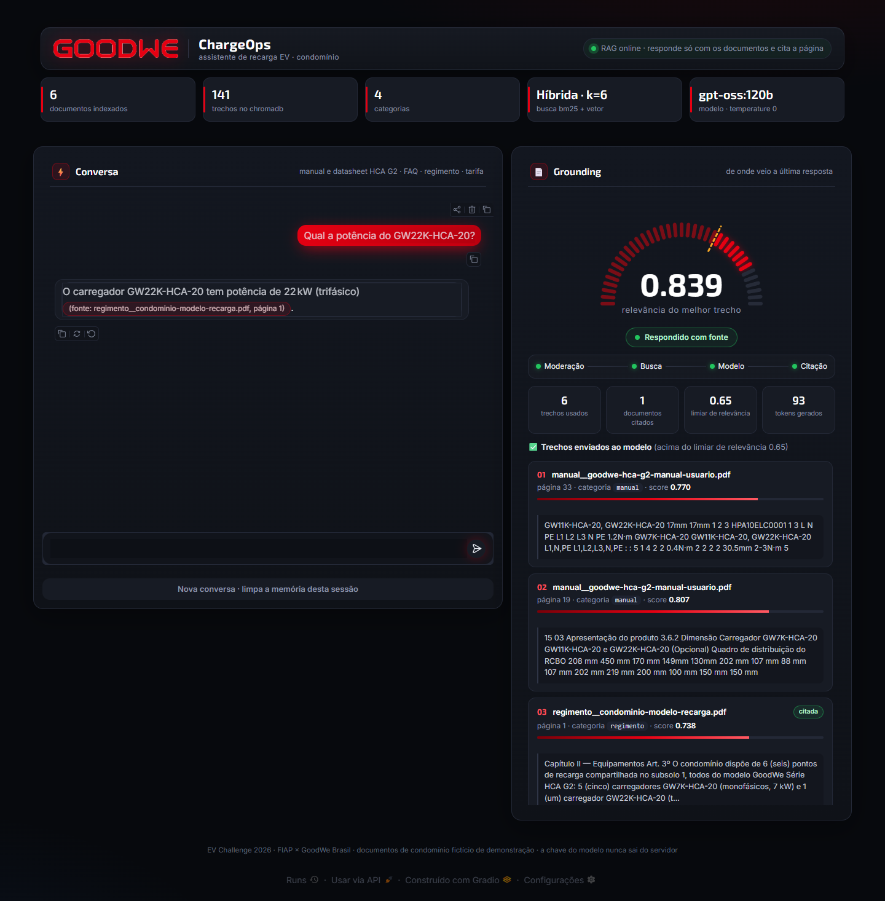
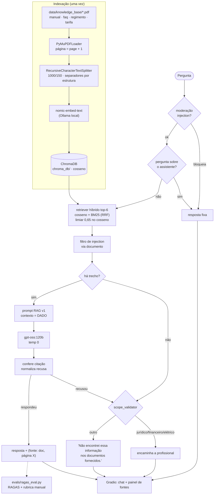

# GoodWe ChargeOps — assistente RAG de recarga de veículos elétricos em condomínio

**EV Challenge 2026 · FIAP × GoodWe Brasil** · Prompt and Artificial Intelligence ·
Prof. Jorge Luiz Gomes · **Sprint 04 — RAG medido, confiável e utilizável** (entrega 23/10/2026)

Chatbot que responde dúvidas de moradores, síndicos e operadores sobre a recarga de
veículos elétricos no condomínio — carregador GoodWe HCA G2, regras de uso da vaga e
tarifa — **somente com base em documentos indexados**, citando documento e página em
toda resposta, e recusando o que a base não tem.



## Integrantes

| Nome | RM | Sprint 04 |
|---|---|---|
| Davi Q. Zuolo | 571669 | responsável: todo o código, relatórios e commits |
| Gustavo Zagato | 569420 | auditoria da Sprint 04 |
| Daniel Vilela Mana | 571632 | auditoria da Sprint 04 |
| Kayo Henderson | 570706 | auditoria da Sprint 04 |

O grupo divide o trabalho por sprint: cada integrante é responsável por duas sprints do
Challenge. A Sprint 04 ficou com o Davi; os demais fizeram a auditoria.

## Resultado medido (Sprint 04)

| | Iteração 1 | Iteração 2 | Iteração 3 (entregue) |
|---|---|---|---|
| Configuração | prompt v1 · chunk 1000/150 · separadores da aula · busca vetorial · k 4 | prompt v1 · chunk 1000/150 · **separadores por estrutura** · busca vetorial · k 4 | idem · **busca híbrida (BM25 + vetor) · k 6** |
| Faithfulness (RAGAS) | 0,875 | 0,976 | **1,000** |
| Answer relevancy (RAGAS) | 0,714 | 0,780 (repetição 0,742) | 0,789 |
| Rubrica manual (fidelidade / relevância) | 1,00 / 0,93 | 1,00 / 1,00 | 1,00 / 0,96 |
| Taxa de resposta nos casos respondíveis | 92,9% | 100% | 100% |
| Fonte certa citada | 92,9% | 100% | 100% |
| Recusa correta fora da base | 2/2 | 2/2 | 2/2 |
| **Perguntas curtas de morador** (24, `evals/eval_set_robustez.json`): taxa de resposta | — | 62,5% | **91,7%** |

Eval set de 16 casos congelado (`evals/eval_set_rag.json`), juiz `gpt-oss:120b` com
temperature 0, mesmo modelo e seed em todas as iterações. A iteração 3 nasceu de um teste
na interface: "Qual a potência do GW22K-HCA-20" era recusada porque a busca só vetorial
deixava o datasheet fora do top-4. No eval set congelado ela não regride (answer_relevancy
dentro do ruído medido); o ganho está nas perguntas curtas, medido à parte para não mudar a
régua das iterações anteriores ([`docs/relatorio_rag.md`](docs/relatorio_rag.md), seção 4.1). Comparação de modelos (`gemma4:31b`),
de chunk_size (256/512/1024) e de prompts (v2 testado e não adotado — sem ganho medido)
nos relatórios abaixo. Segurança: 39/39 ataques bloqueados com 0 falsos positivos; 3/3
casos de injection **via documento** barrados.

## Requisitos do enunciado — onde estão

| # | Requisito (§3) | Onde | Status |
|---|---|---|---|
| 1 | Base expandida em ChromaDB persistente + `nomic-embed-text` | `data/knowledge_base/` (6 PDFs, 4 categorias), `src/rag/vector_store.py` | ✅ |
| 2 | Pipeline PyMuPDFLoader → RecursiveCharacterTextSplitter → retriever → prompt RAG versionado | `src/rag/` (loader, chunking, embeddings, vector_store, retriever, prompt_rag), `src/chain/rag.py` | ✅ |
| 3 | Grounding + citação de fonte em toda resposta | `src/rag/prompt_rag.py` + pós-processamento em `src/chain/rag.py` | ✅ 100% citado |
| 4 | Avaliação RAGAS (faithfulness, answer_relevancy) + fallback manual | `evals/ragas_eval.py`, `evals/juiz_rag.py`, `evals/rubrica_manual.md`, `evals/resultados/` | ✅ 3 iterações |
| 5 | Interface web com citação visível | `app/main.py`, [`app/README.md`](app/README.md) | ✅ Gradio |
| 6 | Recusa fora do contexto + proteção contra injection via documento | `src/guardrails/`, `prompt_rag.trecho_suspeito`, `evals/injecao_documento_eval.py` | ✅ |
| 7 | Relatório de evolução (PDF, ≤5 págs.) + `relatorio_rag.md` + `relatorio_modelos.md` | [`docs/relatorio_evolucao.pdf`](docs/relatorio_evolucao.pdf), [`docs/relatorio_rag.md`](docs/relatorio_rag.md), [`docs/relatorio_modelos.md`](docs/relatorio_modelos.md) | ✅ 3 págs. |
| §6 | Prompt RAG versionado com ganho | [`prompts/versoes_rag.md`](prompts/versoes_rag.md) | ✅ |
| Bônus | Multi-provider: >1 modelo e >1 prompt | `src/chain/multi_provider.py --rag` (Ollama Cloud + Ollama local) | ✅ |

## Como rodar

Pré-requisitos: **Python 3.13** (o `ragas` não instala no 3.14 sem o Microsoft C++
Build Tools) e **[Ollama](https://ollama.com/download)** instalado (os embeddings rodam
localmente). Passo a passo com prints em [`app/README.md`](app/README.md).

```bat
py -3.13 -m venv venv && venv\Scripts\activate
pip install -r requirements.txt
copy .env.example .env                          REM cole a OLLAMA_API_KEY no .env
ollama pull nomic-embed-text

python -m src.rag.vector_store --reindexar      REM indexa data/knowledge_base/ no ChromaDB
python app/main.py                              REM interface em http://127.0.0.1:7860
```

Outros comandos:

```bat
python -m pytest tests -q                       REM 177 testes offline (não chamam modelo)
python -m src.chain.rag "Qual a potência do GW22K-HCA-20?"     REM uma pergunta, com fontes e scores
python -m evals.guardrails_eval                 REM 39/39 ataques, 0 falso positivo
python -m evals.injecao_documento_eval          REM injection via documento: 3/3
python -m evals.ragas_eval --iteracao 3         REM RAGAS + rubrica manual no eval set (config entregue)
python -m evals.robustez_eval                   REM perguntas curtas de morador, ponta a ponta
python -m evals.recall_retriever                REM recall do retriever por chunk_size x k x busca (sem LLM)
python -m evals.recall_retriever --set robustez --configs 1000:4,1000:6 --estrategias estrutura
python -m src.chain.multi_provider "pergunta" --rag --modelos gpt-oss:120b,gemma4:31b,local:qwen3.5:4b
python -m src.teste_auth                        REM confere chave e modelos da Ollama Cloud
```

**Modelo.** Principal `gpt-oss:120b`, comparação `gemma4:31b` (Ollama Cloud). O
`kimi-k2.6` é aceito pelo código (`OLLAMA_MODEL=kimi-k2.6` ou `kimi-k2.6:cloud`), mas exige
créditos na Ollama Cloud; trocar o modelo exige reexecutar as iterações do eval.

## Fluxo do projeto


```mermaid
flowchart TD
    subgraph IDX["Indexação (uma vez)"]
        PDF["data/knowledge_base/*.pdf<br/>manual · faq · regimento · tarifa"] --> LD["PyMuPDFLoader<br/>página = page + 1"]
        LD --> CK["RecursiveCharacterTextSplitter<br/>1000/150 · separadores por estrutura"]
        CK --> EB["nomic-embed-text<br/>(Ollama local)"]
        EB --> DB[("ChromaDB<br/>chroma_db/ · cosseno")]
    end
    U(["Pergunta"]) --> MOD{"moderação<br/>injection?"}
    MOD -- bloqueia --> FIX["resposta fixa"]
    MOD -- ok --> AP{"pergunta sobre<br/>o assistente?"}
    AP -- sim --> FIX
    AP -- não --> RET["retriever híbrido top-6<br/>cosseno + BM25 (RRF)<br/>limiar 0,65 no cosseno"]
    DB --> RET
    RET --> FIL["filtro de injection<br/>via documento"]
    FIL --> Q{"há trecho?"}
    Q -- não --> SC{"scope_validator"}
    Q -- sim --> PR["prompt RAG v1<br/>contexto = DADO"] --> LLM["gpt-oss:120b<br/>temp 0"] --> PP["confere citação<br/>normaliza recusa"]
    PP -- recusou --> SC
    SC -- jurídico/financeiro/elétrico --> ENC["encaminha a profissional"]
    SC -- outro --> REC["'Não encontrei essa informação<br/>nos documentos fornecidos.'"]
    PP -- respondeu --> OUT["resposta + (fonte: doc, página X)"]
    OUT & REC & ENC & FIX --> UI["Gradio: chat + painel de fontes"]
    OUT -.-> EV["evals/ragas_eval.py<br/>RAGAS + rubrica manual"]
```

Detalhe dos três fluxos (indexação, resposta, avaliação) em
[`docs/arquitetura.md`](docs/arquitetura.md).

## Estrutura

```
app/                   interface Gradio (main.py) + README de execução
data/knowledge_base/   PDFs indexados; fontes/ tem o Markdown dos documentos do grupo
src/rag/               loader, chunking, embeddings, vector_store, retriever, prompt_rag (§5)
src/chain/             rag.py (pipeline RAG), llm.py (modelos e parâmetros), multi_provider.py (bônus)
                       + núcleo conversacional da Sprint 3 (builder, memoria, prompts, tokens)
src/guardrails/        moderação de entrada e validação de escopo/saída
src/ferramentas/       Markdown -> PDF; capturas de tela da interface
src/schemas/, src/dominio/   Pydantic v2 e calculadora de recarga (Sprint 3)
evals/                 eval set RAG, RAGAS, rubrica manual, recall, guardrails, injection,
                       resultados/ (JSONs medidos) e baseline_sprint3/ (coluna "antes", congelada)
prompts/               versoes_rag.md + prompts do chatbot da Sprint 3
docs/                  relatórios, arquitetura, changelog, briefs das fases, img/
tests/                 177 testes offline
```

## Documentos

- [Relatório de evolução (PDF)](docs/relatorio_evolucao.pdf) — §8, tabela antes/depois
- [Relatório técnico do RAG](docs/relatorio_rag.md) — chunking, base, retriever, grounding, divergências das aulas
- [Relatório de modelos e parâmetros](docs/relatorio_modelos.md) — §6
- [Versões do prompt RAG](prompts/versoes_rag.md) · [Rubrica manual](evals/rubrica_manual.md)
- [Changelog da Sprint 04](docs/CHANGELOG_SPRINT4.md) · [Arquitetura](docs/arquitetura.md)

## Histórico

O código das Sprints 1, 2 e 3 (inclusive o legado `ai/`) está preservado na tag Git
`sprint3-final`. Os resultados medidos dessas sprints ficam em `evals/baseline_sprint3/`
e são a coluna "antes" do relatório.
