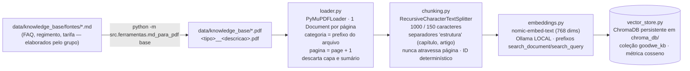
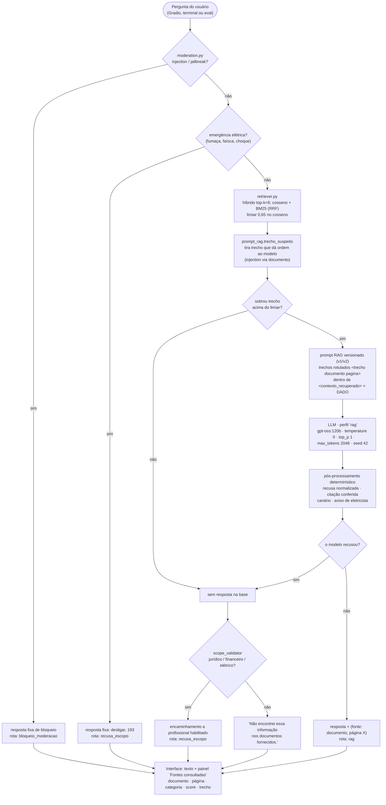
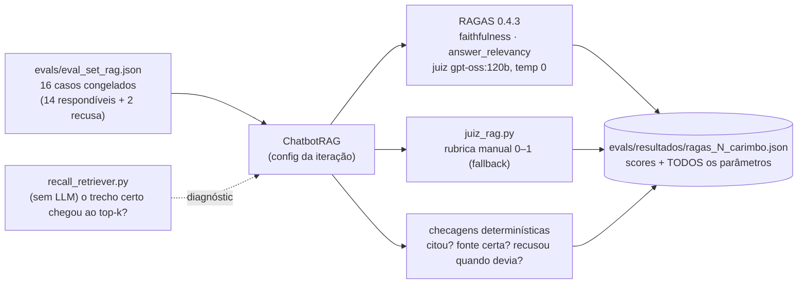

# Arquitetura e fluxo — GoodWe ChargeOps (Sprint 04)

Três fluxos: **indexação** (uma vez, ou quando a base muda), **resposta** (a cada
pergunta, igual na interface, no terminal e no eval) e **avaliação** (por iteração).

## 1. Indexação — `python -m src.rag.vector_store --reindexar`

## 2. Resposta — `ChatbotRAG` (`src/chain/rag.py`)

A mesma função atende a interface (`app/main.py`, com streaming), o terminal
(`python -m src.chain.rag`) e o eval (`evals/ragas_eval.py`). A ordem das etapas é o
acordo do `CLAUDE.md` §6: o retriever decide antes do validador de escopo.

## 3. Avaliação — `python -m evals.ragas_eval --iteracao N`

## Onde cada coisa mora

| Pasta | Papel |
|---|---|
| `data/knowledge_base/` | PDFs indexados (4 categorias) e `fontes/` com o Markdown dos documentos do grupo |
| `src/rag/` | os 6 módulos do §5: loader, chunking, embeddings, vector_store, retriever, prompt_rag |
| `src/chain/rag.py` | composição LCEL do pipeline RAG (`ChatbotRAG`), com e sem streaming |
| `src/chain/llm.py` | fábrica de LLMs, perfis de parâmetros (`PERFIS`), provedores `nuvem:`/`local:` |
| `src/chain/multi_provider.py` | bônus: matriz modelo × prompt em `RunnableParallel`, nuvem + local |
| `src/guardrails/` | moderação de entrada e validação de escopo/saída (Sprint 3, inalterado) |
| `src/ferramentas/md_para_pdf.py` | Markdown → PDF (documentos do grupo e relatório de evolução) |
| `app/main.py` | interface Gradio com painel de fontes, streaming e memória por sessão |
| `evals/` | eval set, RAGAS + rubrica manual, recall do retriever, guardrails, linha de base |
| `docs/` | changelog, relatórios, briefs das fases |
| `src/app.py`, `src/chain/builder.py`, `prompts/system_prompt_v*.md` | chatbot conversacional da Sprint 3 (linha de base, mantido) |
